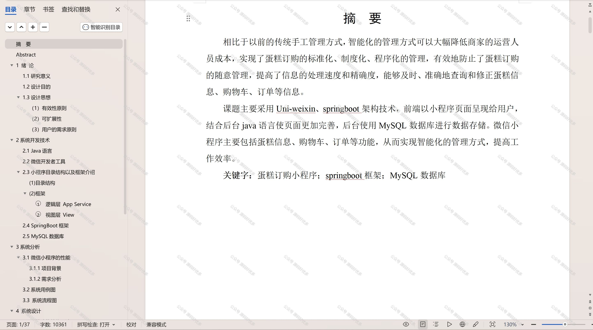

 
## 查看主页获取源码

> **作者介绍**： **✌**全网粉丝10W+本平台特邀作者、博客专家、CSDN新星计划导师、java领域优质创作者,博客之星、掘金/华为云/阿里云/InfoQ等平台优质作者、专注于项目实战 **✌**

  

### 一、作品包含

源码+数据库+设计文档万字+PPT+全套环境和工具资源+部署教程

### 二、项目技术

前端技术：Html、Css、Js、Vue、Element-ui

数据库：MySQL

后端技术：Java、Spring Boot、MyBatis

  

### 三、运行环境

开发工具：IDEA/eclipse + 微信开发者工具

数据库：MySQL5.7

数据库管理工具：Navicat10以上版本

环境配置软件： JDK1.8+Maven3.6.3

前端Nodejs：14

### 四、项目介绍
项目编号：mpweixinA004

蛋糕订购小程序，专为烘焙爱好者和庆祝特殊时刻的消费者设计，提供了一个温馨而便捷的在线订购平台。在这里，您可以挑选各式精美蛋糕，从经典口味到个性化定制，满足不同的口味需求。小程序简洁的界面和流畅的操作体验，让订购蛋糕变得更加简单快捷，无论是生日庆典还是节日庆祝，都能为您传递甜蜜与祝福。

前台用户功能：浏览首页、蛋糕信息、蛋糕资讯、购物车、我的收藏管理、用户充值、在线聊天、购物车、我的订单。

后台管理员的功能：系统首页、个人中心、用户管理、蛋糕信息管理、蛋糕分类管理、口味管理、系统管理和订单管理。

### 五、运行截图

  
